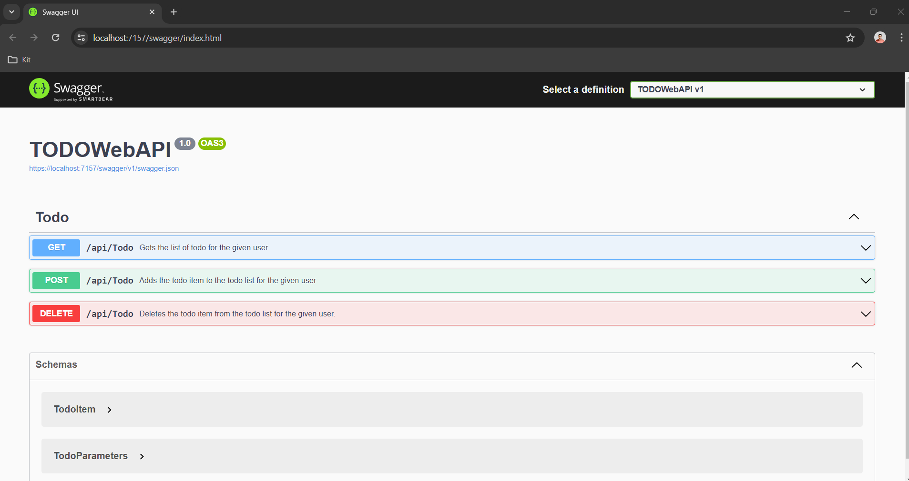

**Running the API**
1. Prerequisites:
    - Visual Studio 2022
    - Install .NET 6 SDK if you haven’t already.
2. Clone the Repository:
    - Clone your project repository to your local machine.
6. Build and Run:
    - Open a terminal/command prompt in the project directory.
    - Run the following commands:
      - dotnet restore
      - dotnet build
      - dotnet run
7. API Endpoints:
    - Use Swagger for API documentation at https://localhost:7157/swagger/index.html
      
        
    - You can test them using tools like Postman or from your browser.
8. Sample Request:
    - Add an item to the Todo list:
      - curl -X 'POST' \
  'https://localhost:7157/api/Todo' \
  -H 'accept: text/plain' \
  -H 'Content-Type: application/json' \
  -d '{
  "userId": "user1",
  "text": "Reply to Sam"
}
    - Get all the todo list for the user:
      - https://localhost:7157/api/Todo?user=user1
	- Delete an item from the todo list
	  - https://localhost:7157/api/Todo?user=user1&text=Reply%20to%20Sam
9. Logging using Serilog:
    - Run the application and check the console and the TODOWebAPILogs.txt file for logged messages under the project directory.